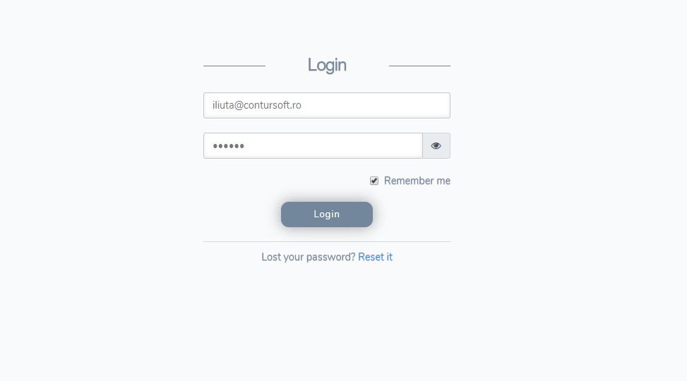
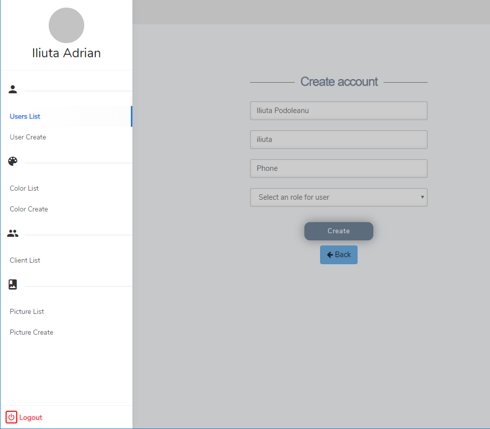
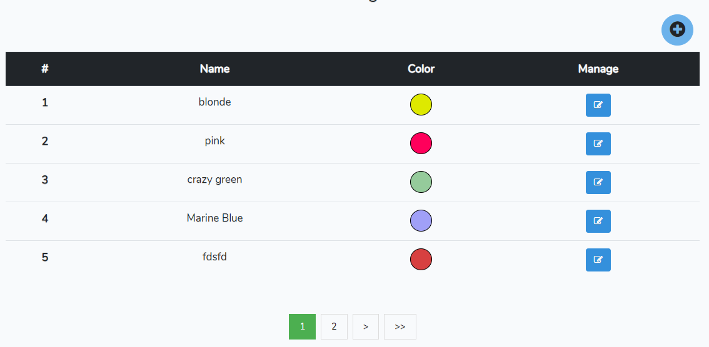
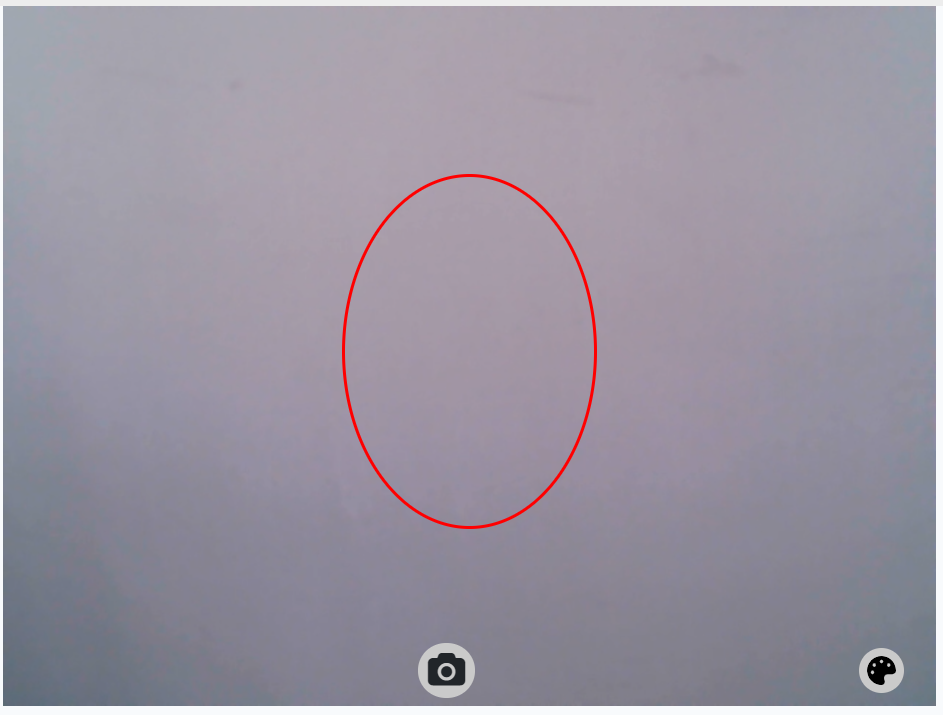
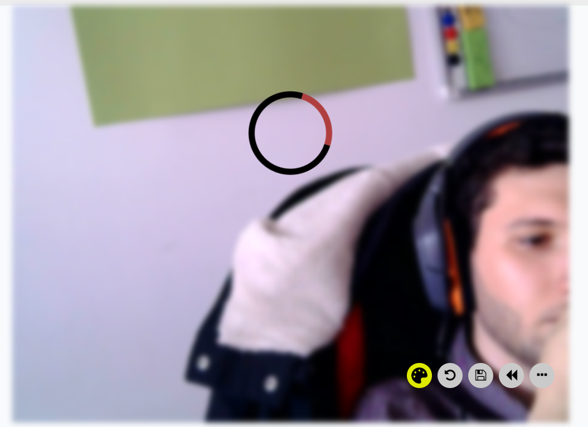

For this project to work you need to follow:
1. composer update
2. php artisan key:generate
5. npm install

To start the aplication:
1. php artisan serve
2. npm run watch
3. open the http://127.0.0.1:8000

Colorize is a web platform that let's you change the color of your hair. It helps hair saloons to show their clients if it's a good ideea to change their hair color.

It is build using:
Laravel 5.4,
Laravel Passport,
VueJS

It has all the auth functionality, implemented using laravel Passport.

After you log in using your account, it will redirect you to the page of your coresponding role.

On the admin account you can add colors coresponding to the hair saloon hair dye's.

To change your color you need to first select the color you want to change in and put your head in the oval and press the camera button. 

    
